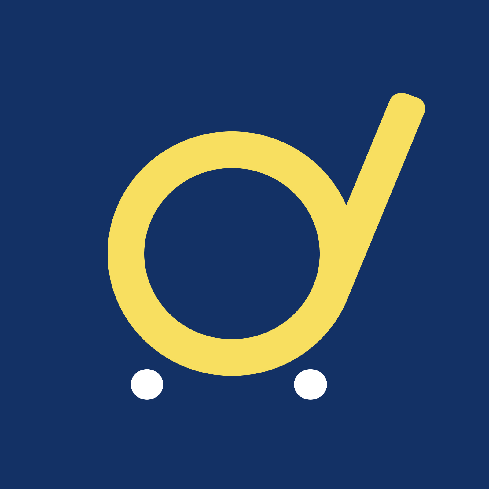
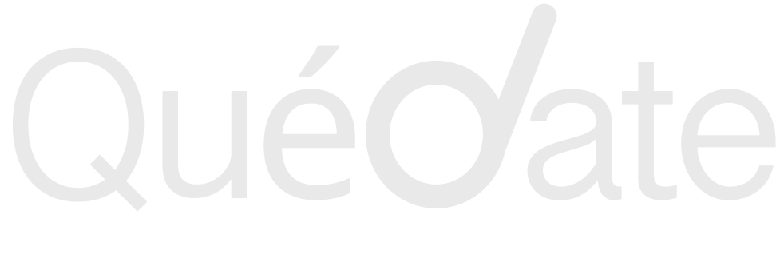

# CLAUDE.md — Guía de Desarrollo: theivanzheng.com

Guía para continuar el desarrollo de este portfolio con Claude Code. Léela entera antes de tocar código.

---

## Qué es este proyecto

Portfolio personal de **Ivan Zheng** — freelancer de ingeniería informática, desarrollo web y consultoría digital. La web es un **single HTML file** (`theivanzheng.html`) con CSS inline y JS al final del body. Sin frameworks, sin build tools, sin compilación.

El objetivo inmediato es construir **`proyectos.html`**: una página independiente que muestra los proyectos de Ivan con más detalle que la sección de la home.

---

## Reglas de código inamovibles

1. **Vanilla únicamente.** Cero frameworks (React, Vue, Angular), cero bundlers (Webpack, Vite), cero TypeScript. HTML + CSS + JS puro.
2. **CSS inline en `<style>`** dentro del `<head>`. No hojas externas nuevas salvo Google Fonts.
3. **JS al final del `<body>`**, en un `<script>` inline. No archivos `.js` externos salvo `content-loader.js`.
4. **Diseño oscuro monocromático.** Fondo #0a0a0a, sin colores vivos, sin gradientes de color (solo grises/negros).
5. **Todo en español.** Textos, labels, mensajes de error — siempre en español.
6. **Consistencia visual total.** Cualquier nueva sección debe parecer diseñada el mismo día que las demás.

---

## Sistema de Diseño

### Colores (variables CSS)

```css
:root {
  --black: #0a0a0a;          /* Fondo general de la página */
  --white: #ffffff;           /* Texto principal y títulos */
  --copy-small: #d9d9d9;     /* Párrafos, texto secundario */
  --gray-light: #e8e8e8;     /* Bordes finos / elementos claros */
  --gray-mid: #aaaaaa;       /* Hover en iconos, texto terciario */
  --border: #2a2a2a;         /* Bordes oscuros de paneles */
  --card-bg: #111111;        /* Fondo de tarjetas */
  --panel-card: #151515;     /* Fondo de secciones/paneles */
  --content-width: 1240px;   /* Max-width del contenido */
}
```

**Nunca** usar colores fuera de esta paleta. Si hace falta un tono intermedio, usar `rgba(255,255,255, X)` o `rgba(10,10,10, X)`.

### Tipografía

```css
/* TÍTULOS de sección y nombres de proyectos */
font-family: 'Playfair Display', serif;
font-weight: 400;
letter-spacing: 0.08em;

/* TODO LO DEMÁS: cuerpo, labels, botones, nav */
font-family: 'Inter', sans-serif;
font-weight: 400;
```

Escalas a recordar:
- Hero H1: `clamp(52px, 10vw, 110px)`
- Títulos de sección (`.section-label`): `54px` desktop / `42px` tablet / `34px` mobile
- Títulos de proyecto (`.proyecto-item h3`): `40px`
- Párrafos de sección: `16-18px`, `line-height: 1.72`
- Nav center: `24px`, `letter-spacing: 0.01em`

Para énfasis inline dentro de un párrafo se usa:
```html
<span class="playfair-inline">texto en cursiva</span>
```
```css
.playfair-inline { font-family: 'Playfair Display', serif; font-style: italic; font-weight: 600; }
```

### Layout y espaciado

```css
/* Contenedor de contenido */
.container {
  max-width: 1240px;
  margin: 0 auto;
  padding: 0 56px;   /* tablet: 24px · mobile: 18px */
}

/* Secciones */
section { padding: 104px 0; }   /* tablet/mobile: 68px 0 */

/* Paneles internos (.inner) */
.inner {
  padding: 46px 52px 42px;
  background: var(--panel-card);
  border: 1px solid #2b2b2b;
  border-radius: 24px;
}
```

### Breakpoints

```css
@media (max-width: 640px)  { /* Mobile  */ }
@media (max-width: 1024px) { /* Tablet  */ }   /* min-width: 641px implícito */
@media (min-width: 1025px) { /* Desktop */ }
```

---

## Componentes Clave

### Animaciones Reveal

Todos los elementos animados en scroll llevan clase `.reveal`. Los hermanos en cascada llevan `.reveal-delay-1`, `.reveal-delay-2`, `.reveal-delay-3`.

```css
.reveal {
  opacity: 0;
  transform: translateY(42px);
  transition: opacity 0.8s ease, transform 0.8s ease;
  will-change: opacity, transform;
}
.reveal.is-visible { opacity: 1; transform: translateY(0); }
.reveal-delay-1 { transition-delay: 0.08s; }
.reveal-delay-2 { transition-delay: 0.16s; }
.reveal-delay-3 { transition-delay: 0.24s; }
```

El JS que lo activa usa `IntersectionObserver` con `threshold: 0.08`. El hero se marca visible inmediatamente al cargar. **Siempre añadir `.reveal` a los contenedores principales de cada nueva sección.**

### Card Stacks (tarjetas apiladas)

Patrón de 2-3 fotos absolutamente posicionadas, rotadas, con efecto de separación en hover. Cada variante tiene nombre propio:

| Clase | Sección | Tarjetas |
|-------|---------|----------|
| `.cards-stack` | Sobre Mí | 2 (la 1a oculta) |
| `.cards-stack-nada` | Nada | 3 |
| `.cards-stack-nl` | Newsletter | 2 |
| `.cards-stack-contact` | Contacto | 1 |

Estructura base siempre igual:
```html
<div class="cards-stack-NOMBRE reveal reveal-delay-1">
  <div class="card-item">
    
  </div>
  <div class="card-item">
    
  </div>
</div>
```

Estilo base de `.card-item`:
```css
.card-item {
  position: absolute;
  background: #ffffff10;
  border: 1px solid #ffffff18;
  border-radius: 28px;
  overflow: hidden;
  transition: transform 0.4s ease, z-index 0.4s ease;
}
.card-item img { width: 100%; height: 100%; object-fit: cover; display: block; }
```

### Project Cards (imágenes de proyectos)

Las imágenes en la sección de proyectos son cuadradas (420×420px), rotadas ligeramente:

```css
.project-card-img {
  width: 420px; height: 420px;
  background: var(--black);
  border-radius: 34px;
  flex-shrink: 0;
  transform: rotate(-21deg) translateZ(0);
  overflow: hidden;
  box-shadow: 0 0 0 1px var(--panel-card);
}
.project-card-img img {
  position: absolute; top: 50%; left: 50%;
  width: 103%; height: 103%;
  object-fit: contain;
  transform: translate(-50%, -50%);
  border-radius: inherit;
}
```

La rotación varía por proyecto (-17° a -21°). En mobile: `width: 120px; height: 120px`.

### Navegación

La nav es `position: fixed`, tres partes:
- `.nav-left`: enlaces izquierda (Sobre Mí, Productos)
- `.nav-center`: "IVAN ZHENG" centrado absolutamente
- `.nav-right`: enlaces derecha (Proyectos, Contacto)

Al hacer scroll >24px añade clase `.nav-scrolled` (backdrop blur).

### Formularios

Patrón de inputs:
```css
input[type="email"], input[type="text"], textarea {
  width: 100%;
  background: transparent;
  border: 1.5px solid #d9d9d9;
  border-radius: 14px;
  color: var(--white);
  font-family: 'Inter', sans-serif;
  font-size: 17px;
  padding: 16px 18px;
}
```
Botón de envío: `background: var(--white); color: var(--black)`.

---

## Sistema de Contenidos JSON

Los textos NO están en el HTML sino en `/textos/*.json`. El archivo `content-loader.js` los carga e inyecta.

```
textos/proyectos.json  →  títulos y descripciones de cada proyecto
textos/sobre-mi.json   →  texto de Sobre Mí
textos/newsletter.json →  copy del formulario newsletter
```

**Al editar contenido:** modificar el JSON, no el HTML.
**Al crear nueva sección:** crear su JSON + agregar método `inject[Sección]()` en `content-loader.js`.

Los `\n\n` se convierten en `<p>` y los `\n` simples en `<br>`.

---

## Página de Proyectos — Especificaciones (`proyectos.html`)

El objetivo es una página independiente (`proyectos.html`) que muestre todos los proyectos de Ivan con más detalle. **Debe sentirse como continuación visual de la home**, usando exactamente los mismos patrones.

### Estructura de la página

```
1. <head>  — mismos estilos base (variables CSS, tipografía, reset)
2. <nav>   — misma nav que la home (copiar exacto)
3. .hero-proyectos — cabecera de página (sin video, fondo oscuro, título grande)
4. .proyectos-grid  — grid de tarjetas con todos los proyectos
5. .proyecto-detalle — sección expandida por proyecto (una por cada uno)
6. <footer> — mismo footer que la home
```

### Hero de la página de proyectos

Sin video. Fondo negro con texto centrado:

```html
<section class="hero-inner reveal" id="inicio">
  <div class="container">
    <p class="section-label reveal">Proyectos</p>
    <h1 class="reveal reveal-delay-1">Lo que he construido</h1>
    <p class="hero-inner-desc reveal reveal-delay-2">
      Desde plataformas SaaS hasta creación de contenido. Cada proyecto es un experimento real.
    </p>
  </div>
</section>
```

```css
.hero-inner {
  padding: 160px 0 80px;
  text-align: center;
}
.hero-inner h1 {
  font-family: 'Playfair Display', serif;
  font-size: clamp(48px, 8vw, 96px);
  font-weight: 400;
  letter-spacing: 0.06em;
  margin-bottom: 24px;
}
.hero-inner-desc {
  font-size: 18px;
  color: var(--copy-small);
  max-width: 560px;
  margin: 0 auto;
  line-height: 1.72;
}
```

### Grid de tarjetas de proyectos

Una cuadrícula 3 columnas desktop / 2 tablet / 1 mobile con una tarjeta por proyecto:

```html
<section class="proyectos-index reveal" id="proyectos">
  <div class="container">
    <div class="proyectos-index-grid">

      <a class="proyecto-card reveal" href="#quédate">
        <div class="proyecto-card-img">
          
        </div>
        <div class="proyecto-card-info">
          
          <p class="proyecto-card-tag">Plataforma · 2023</p>
          <p class="proyecto-card-desc">Fidelización y QR para comercio local. +100 negocios.</p>
        </div>
      </a>

      <!-- Repetir para cada proyecto -->

    </div>
  </div>
</section>
```

```css
.proyectos-index-grid {
  display: grid;
  grid-template-columns: repeat(3, 1fr);
  gap: 24px;
}

.proyecto-card {
  display: block;
  background: var(--panel-card);
  border: 1px solid var(--border);
  border-radius: 20px;
  overflow: hidden;
  text-decoration: none;
  color: var(--white);
  transition: transform 0.25s ease, border-color 0.25s ease;
}
.proyecto-card:hover {
  transform: translateY(-4px);
  border-color: #444444;
}

.proyecto-card-img {
  width: 100%;
  aspect-ratio: 4/3;
  overflow: hidden;
  background: var(--card-bg);
}
.proyecto-card-img img {
  width: 100%;
  height: 100%;
  object-fit: cover;
  transition: transform 0.35s ease;
}
.proyecto-card:hover .proyecto-card-img img { transform: scale(1.04); }

.proyecto-card-info { padding: 24px; }

.proyecto-card-logo {
  height: 28px;
  width: auto;
  margin-bottom: 12px;
  opacity: 0.9;
}

.proyecto-card-tag {
  font-size: 13px;
  color: var(--gray-mid);
  margin-bottom: 8px;
  letter-spacing: 0.04em;
  text-transform: uppercase;
}

.proyecto-card-desc {
  font-size: 15px;
  color: var(--copy-small);
  line-height: 1.5;
}

@media (max-width: 1024px) {
  .proyectos-index-grid { grid-template-columns: repeat(2, 1fr); }
}
@media (max-width: 640px) {
  .proyectos-index-grid { grid-template-columns: 1fr; }
}
```

### Secciones detalle por proyecto

Cada proyecto tiene su propia sección expandida debajo del grid. Misma estructura que `.proyecto-item` de la home pero con más contenido:

```html
<section class="proyecto-detalle reveal" id="quédate">
  <div class="container">
    <div class="proyecto-detalle-inner">

      <!-- Columna de texto -->
      <div class="proyecto-detalle-text reveal">
        
        <div class="proyecto-meta">
          <span class="proyecto-tag">SaaS</span>
          <span class="proyecto-tag">2023</span>
          <span class="proyecto-tag">Activo</span>
        </div>
        <p>Descripción larga del proyecto...</p>
        <p>Segundo párrafo con más detalle...</p>
        <div class="proyecto-stats">
          <div class="stat">
            <span class="stat-num">100+</span>
            <span class="stat-label">negocios</span>
          </div>
          <div class="stat">
            <span class="stat-num">5k+</span>
            <span class="stat-label">usuarios</span>
          </div>
        </div>
        <a class="proyecto-cta" href="https://URL" target="_blank" rel="noopener">
          Ver proyecto →
        </a>
      </div>

      <!-- Imagen rotada (igual que home) -->
      <div class="project-card-img reveal reveal-delay-1">
        
      </div>

    </div>
  </div>
</section>
```

```css
.proyecto-detalle {
  padding: 0 0 80px;
}

.proyecto-detalle-inner {
  background: var(--panel-card);
  border: 1px solid #2b2b2b;
  border-radius: 16px;
  padding: 52px 60px;
  display: grid;
  grid-template-columns: 1fr auto;
  gap: 72px;
  align-items: center;
}

.proyecto-logo-grande {
  height: 36px;
  width: auto;
  margin-bottom: 20px;
}

.proyecto-meta {
  display: flex;
  gap: 8px;
  margin-bottom: 24px;
  flex-wrap: wrap;
}
.proyecto-tag {
  font-size: 13px;
  color: var(--gray-mid);
  border: 1px solid var(--border);
  border-radius: 999px;
  padding: 4px 14px;
  letter-spacing: 0.03em;
}

.proyecto-detalle-text p {
  font-size: 17px;
  line-height: 1.72;
  color: var(--copy-small);
  margin-bottom: 18px;
  max-width: 680px;
}

.proyecto-stats {
  display: flex;
  gap: 40px;
  margin: 32px 0 36px;
}
.stat { display: flex; flex-direction: column; gap: 4px; }
.stat-num {
  font-family: 'Playfair Display', serif;
  font-size: 40px;
  font-weight: 400;
  color: var(--white);
  line-height: 1;
}
.stat-label { font-size: 14px; color: var(--gray-mid); }

.proyecto-cta {
  display: inline-block;
  color: var(--white);
  font-size: 15px;
  font-weight: 500;
  text-decoration: none;
  border-bottom: 1px solid rgba(255,255,255,0.3);
  padding-bottom: 2px;
  transition: border-color 0.2s, opacity 0.2s;
}
.proyecto-cta:hover { border-color: var(--white); opacity: 0.85; }

/* Mobile */
@media (max-width: 1024px) {
  .proyecto-detalle-inner {
    grid-template-columns: 1fr;
    gap: 32px;
    padding: 32px 28px;
  }
  .project-card-img { width: 200px; height: 200px; margin: 0 auto; }
}
@media (max-width: 640px) {
  .proyecto-detalle-inner { padding: 20px 16px; gap: 20px; }
  .project-card-img { width: 140px; height: 140px; }
  .stat-num { font-size: 30px; }
}
```

### Proyectos a incluir en proyectos.html

| ID | Nombre | Tags | Stats clave | URL (si existe) |
|----|--------|------|-------------|-----------------|
| `#quédate` | Quédate | SaaS · Comercio local · 2023 | 100+ negocios | — |
| `#revon` | REVON | Agencia · Tech · Activo | — | revon.es (o similar) |
| `#playbeau` | PlayBeau | SaaS · Peluquería · Adquirida | Adquirida por L'Oréal | — |
| `#debtscope` | debtScope | Finanzas · Tool | — | — |
| `#instagram` | @theivanzheng | Contenido · Redes | 100k+ seguidores | instagram.com/theivanzheng |

---

## Imágenes y Recursos

### Carpeta `Resources/cards/`

Nomenclatura: `tipo-proyecto-numero.jpg`

```
proyecto-quedate-1.jpg
proyecto-revon-1.jpg
proyecto-playbeau-1.jpg
proyecto-debtscope-1.jpg    ← crear si no existe
proyecto-theivanzheng-1.jpg
```

Especificaciones:
- Tamaño: 420×420px (cuadrado)
- Formato: JPG comprimido (<200KB)
- Object-fit: contain dentro de `.project-card-img`

### Carpeta `Resources/Long_logos/`

SVG horizontales de cada proyecto. Usar siempre con `object-fit: contain` y altura fija.

### Añadir imagen nueva

1. Comprimir a <200KB (TinyJPG o similar)
2. Nombrar con el patrón correspondiente
3. Colocar en `Resources/cards/`
4. Referenciar con ruta relativa: `./Resources/cards/nombre.jpg`
5. Siempre incluir `loading="lazy" decoding="async"`

---

## Checklist antes de terminar cualquier nueva sección

- [ ] Fondo `var(--black)`, paneles `var(--panel-card)`, bordes `#2b2b2b`
- [ ] Títulos en Playfair Display, cuerpo en Inter
- [ ] Clases `.reveal` y `.reveal-delay-X` en todos los elementos animados
- [ ] Media queries para 640px y 1024px
- [ ] `loading="lazy" decoding="async"` en todas las imágenes
- [ ] Texto visible en español
- [ ] Hover effects con `transition: X 0.2s ease` (nunca sin transition)
- [ ] Ningún color fuera de la paleta de variables CSS

---

## Servidor local

```bash
python3 -m http.server 8000
# Abrir: http://localhost:8000/theivanzheng.html
# Proyectos: http://localhost:8000/proyectos.html
```

---

## Archivos que NO tocar sin avisar

- `backend/src/server.js` — lógica de email/Supabase/Resend
- `api/newsletter/` — serverless functions de producción
- `content-loader.js` — solo modificar para añadir secciones nuevas, nunca refactorizar

## Archivos seguros para editar libremente

- `theivanzheng.html` — página principal
- `proyectos.html` — página de proyectos (en construcción)
- `textos/*.json` — contenidos
- `Resources/` — añadir imágenes/logos
