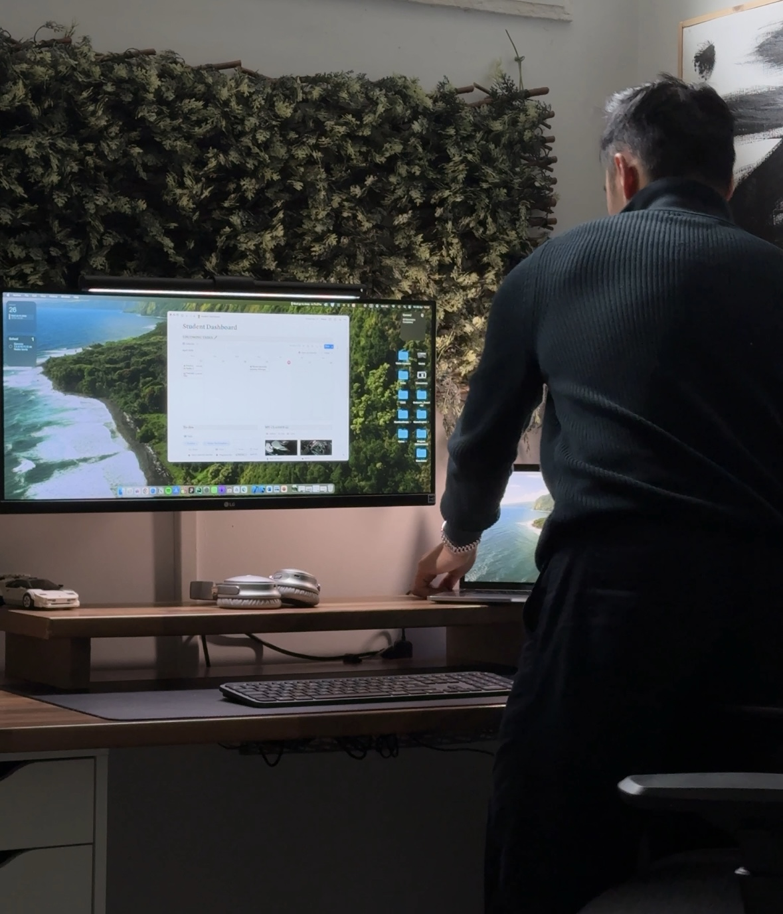

# Sistema de Diseño — Ivan Zheng Portfolio

Documentación completa del patrón de diseño, estructura y componentes utilizados en la web de Ivan Zheng. Esta guía permite replicar exactamente el diseño en futuras versiones y ampliaciones.

---

## Tabla de Contenidos

1. [Paleta de Colores](#paleta-de-colores)
2. [Tipografía](#tipografía)
3. [Estructura General](#estructura-general)
4. [Componentes y Bloques](#componentes-y-bloques)
5. [Sistema de Proyectos](#sistema-de-proyectos)
6. [Tarjetas Apiladas (Cards Stack)](#tarjetas-apiladas-cards-stack)
7. [Animaciones Reveal](#animaciones-reveal)
8. [Formularios](#formularios)
9. [Sistema de Contenidos JSON](#sistema-de-contenidos-json)
10. [Recursos Visuales](#recursos-visuales)
11. [Responsive Design](#responsive-design)
12. [Checklist para Nuevas Secciones](#checklist-para-nuevas-secciones)

---

## Paleta de Colores

### CSS Variables Principales

```css
:root {
  --black: #0a0a0a;                    /* Fondo principal */
  --white: #ffffff;                    /* Texto primario */
  --gray-light: #e8e8e8;              /* Borde claro */
  --gray-mid: #aaaaaa;                /* Texto secundario */
  --border: #2a2a2a;                  /* Borde oscuro */
  --card-bg: #111111;                 /* Fondo tarjetas */
  --panel-card: #151515;              /* Fondo paneles */
  --copy-small: #d9d9d9;              /* Texto secundario (párrafos) */
}
```

### Tabla de Colores

| Elemento | Color | Hex | RGB | Uso |
|----------|-------|-----|-----|-----|
| Fondo página | Negro | `#0a0a0a` | 10, 10, 10 | Body background |
| Texto primario | Blanco | `#ffffff` | 255, 255, 255 | Títulos, navegación |
| Texto secundario | Gris clarito | `#d9d9d9` | 217, 217, 217 | Párrafos, descripciones |
| Borde claro | Gris muy claro | `#e8e8e8` | 232, 232, 232 | Bordes finos |
| Borde oscuro | Gris oscuro | `#2a2a2a` | 42, 42, 42 | Bordes paneles |
| Panel de contenido | Gris muy oscuro | `#151515` | 21, 21, 21 | Fondo secciones |
| Hover estados | Gris medio | `#aaaaaa` | 170, 170, 170 | Enlaces hover |

### Esquema Monocromático

- **Objetivo**: Elegancia minimalista oscura
- **Contraste**: Alto (blanco sobre negro)
- **Accesibilidad**: WCAG AA+
- **Atmósfera**: Lujo moderno, profesional

---

## Tipografía

### Fuentes

```css
/* Títulos y encabezados */
font-family: 'Playfair Display', serif;
font-size: 24px - 110px (clamp para responsivo);
font-weight: 400 (regular);
letter-spacing: 0.08em;

/* Cuerpo y párrafos */
font-family: 'Inter', sans-serif;
font-size: 15px - 18px;
font-weight: 400;
line-height: 1.28 - 1.72;
```

### Importación

```html
<link href="https://fonts.googleapis.com/css2?family=Inter:wght@300;400;500;600&family=Playfair+Display:wght@400;700&display=swap" rel="stylesheet" />
```

### Escalas Tipográficas

| Elemento | Font | Tamaño | Weight | Line-height | Uso |
|----------|------|--------|--------|-------------|-----|
| Hero H1 | Playfair Display | `clamp(52px, 10vw, 110px)` | 400 | 1 | Título principal hero |
| Sección Label | Playfair Display | 54px | 400 | 1.2 | Títulos de sección |
| Proyecto H3 | Playfair Display | 40px | 400 | 1.3 | Títulos proyectos |
| Sobre Mí H2 | Inter | 52px | 400 | 1.2 | Subencabezados |
| Párrafos generales | Inter | 16px | 400 | 1.28 | Descripción de secciones |
| Párrafos chicos | Inter | 17px | 400 | 1.72 | Newsletter, contacto |
| Etiquetas formulario | Inter | 14px | 400 | 1 | Labels inputs |

### Variantes Playfair Inline

En ciertos párrafos se usa `<span class="playfair-inline">`:

```css
.playfair-inline {
  font-family: 'Playfair Display', serif;
  font-style: italic;
  font-weight: 600;
}
```

Ejemplo: "Iván Zheng estudió **_Ingeniería Informática_** en Salamanca."

---

## Estructura General

### Layout Base

```
html (scroll-behavior: smooth)
  └─ body
      ├─ nav#site-nav (fixed, z-index 100)
      ├─ section.hero#inicio
      ├─ section.projects-nav#proyectos
      ├─ section.sobre-mi#sobre-mi
      ├─ section.nada
      ├─ section.newsletter
      ├─ section.proyectos-detail#proyectos-detalle
      ├─ section.trabajemos#contacto
      └─ footer
```

### Spacing y Layout

```css
/* Contenedor de contenido */
.container {
  max-width: 1240px;
  margin: 0 auto;
  padding: 0 56px;          /* Desktop */
  /* Tablet: 24px, Mobile: 18px */
}

/* Secciones */
section {
  padding: 104px 0;         /* Desktop */
  /* Tablet: 68px 0, Mobile: 68px 0 */
}

/* Espacios internos */
.inner {
  padding: 46px 52px 42px;  /* Desktop */
  /* Tablet: varies, Mobile: 16px */
}
```

### Z-Index Hierarchy

```
100  - Navigation (fixed)
3    - Hero scroll indicator
2    - Hero content
1    - Project card images (rotated)
0    - Default content
```

---

## Componentes y Bloques

### 1. Navegación

```html
<nav id="site-nav">
  <div class="nav-left">
    <a href="#sobre-mi">Sobre Mí</a>
    <a href="#proyectos">Productos</a>
  </div>
  <div class="nav-center">IVAN ZHENG</div>
  <div class="nav-right">
    <a href="#proyectos-detalle">Proyectos</a>
    <a href="#contacto">Contacto</a>
  </div>
  <!-- Mobile menu button -->
  <button id="nav-toggle" class="nav-toggle" type="button">
    <span></span>
    <span></span>
  </button>
  <!-- Mobile menu -->
  <div id="nav-mobile-menu" class="nav-mobile-menu">
    <a href="#inicio">Inicio</a>
    <a href="#sobre-mi">Sobre Mí</a>
    <a href="#proyectos-detalle">Proyectos</a>
    <a href="#contacto">Contacto</a>
  </div>
</nav>
```

**Estilos clave:**

```css
nav {
  position: fixed;
  top: 0; left: 0; right: 0;
  z-index: 100;
  height: 64px;
  padding: 0 56px;
  display: flex;
  justify-content: space-between;
  align-items: center;
}

nav .nav-center {
  position: absolute;
  left: 50%;
  transform: translateX(-50%);
  font-family: 'Playfair Display', serif;
  font-size: 24px;
  letter-spacing: 0.01em;
}

.nav-scrolled {
  background: rgba(10, 10, 10, 0.72);
  backdrop-filter: blur(10px);
}
```

**Comportamiento:**
- Se activa `nav-scrolled` cuando se hace scroll > 24px
- Mobile: hamburguesa oculta en desktop, visible en móvil

---

### 2. Hero Section

```html
<section class="hero" id="inicio">
  <video class="hero-video" autoplay muted loop playsinline>
    <source src="./Resources/hero_v1.mp4" type="video/mp4" />
  </video>
  <div class="hero-content">
    <h1>IVAN ZHENG</h1>
  </div>
  <div class="hero-scroll">
    <svg width="24" height="16" viewBox="0 0 24 16" fill="none">
      <path d="M2 2L12 12L22 2" stroke="white" stroke-width="2"/>
      <path d="M2 7L12 17L22 7" stroke="white" stroke-width="1.5" opacity="0.5"/>
    </svg>
  </div>
</section>
```

**Estilos clave:**

```css
.hero {
  min-height: 100vh;
  position: relative;
  overflow: hidden;
}

.hero::after {
  content: "";
  position: absolute;
  bottom: 0;
  height: 34vh;
  background: linear-gradient(
    to bottom,
    rgba(10, 10, 10, 0) 0%,
    rgba(10, 10, 10, 0.65) 52%,
    var(--black) 100%
  );
  z-index: 1;
}

.hero-video {
  position: absolute;
  inset: 0;
  width: 100%;
  height: 100%;
  object-fit: cover;
  z-index: 0;
}

.hero-content {
  position: relative;
  z-index: 2;
  text-align: center;
  mix-blend-mode: difference;
}

.hero h1 {
  font-family: 'Playfair Display', serif;
  font-size: clamp(52px, 10vw, 110px);
  font-weight: 400;
  letter-spacing: 0.08em;
  line-height: 1;
}

.hero-scroll {
  position: absolute;
  bottom: 48px;
  left: 50%;
  transform: translateX(-50%);
  z-index: 3;
  animation: bounce 1.6s ease-in-out infinite;
}

@keyframes bounce {
  0%, 100% { transform: translateY(0); }
  50% { transform: translateY(6px); }
}
```

**Especificaciones:**
- Video de fondo (`hero_v1.mp4`) con gradient overlay
- Título utiliza `mix-blend-mode: difference` para invertirse sobre video
- Scroll indicator con animación de rebote

---

### 3. Sección de Proyectos/Productos (Grid Nav)

```html
<section class="projects-nav reveal" id="proyectos">
  <div class="container">
    <p class="section-label reveal">Proyectos</p>
    <div class="projects-grid">
      <a class="reveal" href="#quédate">
        
      </a>
      <!-- Más proyectos... -->
    </div>
  </div>
</section>
```

**Estilos clave:**

```css
.projects-nav {
  padding: 62px 0 48px;
}

.projects-grid {
  display: grid;
  grid-template-columns: repeat(3, 1fr);
  gap: 20px 44px;
  max-width: 980px;
  margin: 0 auto;
  align-items: center;
}

.projects-grid a {
  min-height: 112px;
  display: flex;
  align-items: center;
  justify-content: center;
  opacity: 0.85;
  transition: opacity .2s, transform .2s;
}

.projects-grid a:hover {
  opacity: 1;
  transform: translateY(-2px);
}

.projects-grid a img {
  width: 60%;
  height: 60%;
  max-width: 60%;
  max-height: 60%;
  object-fit: contain;
}
```

**Grid responsivo:**
- Desktop: 3 columnas
- Tablet: 3 columnas (gap reducido)
- Mobile: 3 columnas (gap mínimo)

---

## Sistema de Proyectos

### Estructura de Proyectos Detail

```html
<section class="proyectos-detail reveal" id="proyectos-detalle">
  <div class="container">
    <p class="section-label reveal">Proyectos</p>
  </div>

  <!-- Cada proyecto sigue este patrón -->
  <div class="proyecto-item reveal" id="quédate">
    <div class="reveal">
      <h3>Quédate</h3>
      <p>Descripción del proyecto...</p>
    </div>
    <div class="project-card-img reveal reveal-delay-1">
      
    </div>
  </div>
</section>
```

**Estilos clave:**

```css
.proyecto-item {
  max-width: 1240px;
  margin: 0 auto 18px;
  padding: 34px 40px;
  display: grid;
  grid-template-columns: 1fr auto;
  gap: 72px;
  align-items: center;
  background: var(--panel-card);
  border: 1px solid #2b2b2b;
  border-radius: 10px;
  overflow: hidden;
}

.proyecto-item h3 {
  font-family: 'Playfair Display', serif;
  font-size: 40px;
  font-weight: 400;
  margin-bottom: 22px;
}

.proyecto-item p {
  font-size: 18px;
  line-height: 1.72;
  color: var(--copy-small);
  max-width: 880px;
}
```

### Project Card Images

```css
.project-card-img {
  width: 420px;
  height: 420px;
  background: var(--black);
  border-radius: 34px;
  flex-shrink: 0;
  position: relative;
  transform: rotate(-21deg) translateZ(0);
  overflow: hidden;
  box-shadow: 0 0 0 1px var(--panel-card);
}

.project-card-img img {
  position: absolute;
  top: 50%;
  left: 50%;
  width: 103%;
  height: 103%;
  object-fit: contain;
  transform: translate(-50%, -50%) scale(1);
  border-radius: inherit;
}

#instagram .project-card-img img {
  width: 110%;
  height: 110%;
}

/* Rotaciones específicas por proyecto */
.proyecto-item:nth-child(2) .project-card-img { transform: rotate(-21deg); }
.proyecto-item:nth-child(3) .project-card-img { transform: rotate(-18deg); }
.proyecto-item:nth-child(4) .project-card-img { transform: rotate(-19deg); }
.proyecto-item:nth-child(5) .project-card-img { transform: rotate(-20deg); }
.proyecto-item:nth-child(6) .project-card-img { transform: rotate(-17deg); }
```

**Especificaciones de imágenes:**
- Tamaño: 420x420px (cuadrado)
- Formato: JPG (optimizado)
- Rotación: -18° a -21° (varía por proyecto)
- Border-radius: 34px (bordes redondeados)

---

## Tarjetas Apiladas (Cards Stack)

### Estructura General

Hay tres tipos de stacks de tarjetas: `cards-stack`, `cards-stack-nada`, `cards-stack-nl`, `cards-stack-contact`

```html
<div class="cards-stack reveal reveal-delay-1">
  <div class="card-item">
    
    <span class="card-label">Sobre Mí imagen 2</span>
  </div>
  <div class="card-item">
    
    <span class="card-label">Sobre Mí imagen 3</span>
  </div>
</div>
```

### Cards Stack - Sobre Mí

```css
.cards-stack {
  position: relative;
  width: 620px;
  height: 500px;
  flex-shrink: 0;
  margin-top: 20px;
  margin-left: -98px;
  z-index: 1;
}

/* Card 1 (oculta) */
.sobre-mi .card-item:nth-child(1) {
  display: none;
}

/* Card 2 */
.sobre-mi .card-item:nth-child(2) {
  width: 320px;
  height: 438px;
  top: 92px;
  left: 72px;
  transform: rotate(-12deg);
  background: #ffffff;
  border-color: #111111;
  border-radius: 28px;
}

/* Card 3 */
.sobre-mi .card-item:nth-child(3) {
  width: 372px;
  height: 510px;
  top: 8px;
  left: 248px;
  transform: rotate(12deg);
  background: #ffffff;
  border-color: #111111;
  border-radius: 30px;
}

/* Hover effect */
.cards-stack:hover .card-item:nth-child(2) {
  transform: rotate(-12deg) translate(-32px, 28px);
  z-index: 3;
}

.cards-stack:hover .card-item:nth-child(3) {
  transform: rotate(12deg) translate(32px, -28px);
  z-index: 4;
}
```

### Cards Stack - Nada Tiene Sentido

```css
.cards-stack-nada {
  position: relative;
  width: 650px;
  height: 500px;
  margin-top: 20px;
  margin-left: -90px;
  z-index: 1;
}

.cards-stack-nada .card-item:nth-child(1) {
  width: 286px;
  height: 394px;
  top: 134px;
  left: 10px;
  transform: rotate(-23deg);
}

.cards-stack-nada .card-item:nth-child(2) {
  width: 328px;
  height: 456px;
  top: 18px;
  left: 184px;
  transform: rotate(-10deg);
}

.cards-stack-nada .card-item:nth-child(3) {
  width: 366px;
  height: 510px;
  top: 36px;
  left: 326px;
  transform: rotate(22deg);
}

.cards-stack-nada:hover .card-item:nth-child(1) {
  transform: rotate(-23deg) translate(-48px, 32px);
  z-index: 3;
}
/* ... similar para items 2 y 3 */
```

### Cards Stack - Newsletter

```css
.cards-stack-nl {
  position: relative;
  width: 460px;
  height: 380px;
  flex-shrink: 0;
  margin-left: -78px;
}

.cards-stack-nl .card-item:nth-child(1) {
  width: 268px;
  height: 356px;
  top: 52px;
  left: 4px;
  transform: rotate(-19deg);
}

.cards-stack-nl .card-item:nth-child(2) {
  width: 284px;
  height: 380px;
  top: 34px;
  left: 138px;
  transform: rotate(22deg);
}

.cards-stack-nl:hover .card-item:nth-child(1) {
  transform: rotate(-19deg) translate(-38px, 26px);
  z-index: 3;
}

.cards-stack-nl:hover .card-item:nth-child(2) {
  transform: rotate(22deg) translate(38px, -26px);
  z-index: 4;
}
```

### Cards Stack - Contacto

```css
.cards-stack-contact {
  position: relative;
  width: 430px;
  height: 520px;
  flex-shrink: 0;
}

.cards-stack-contact .card-item:nth-child(1) {
  width: 382px;
  height: 286px;
  top: 98px;
  left: 0;
  transform: rotate(0deg);
  background: #ffffff;
  border-color: #111111;
  border-radius: 24px;
}

.cards-stack-contact .card-item:nth-child(2),
.cards-stack-contact .card-item:nth-child(3) {
  display: none;
}

.cards-stack-contact:hover .card-item:nth-child(1) {
  transform: rotate(0deg);
  z-index: 3;
}
```

### Estilos Base Card Item

```css
.card-item {
  position: absolute;
  background: #ffffff10;
  border: 1px solid #ffffff18;
  border-radius: 16px;
  backdrop-filter: blur(4px);
  overflow: hidden;
  transition: transform 0.4s ease, z-index 0.4s ease;
}

.card-item img {
  width: 100%;
  height: 100%;
  object-fit: cover;
  object-position: center;
  display: block;
  transform: scale(1);
  transition: transform 0.22s ease;
}

.card-item .card-label {
  position: absolute;
  bottom: 24px;
  left: 20px;
  right: 20px;
  padding: 12px 0;
  font-size: 13px;
  color: #8a8a8a;
  font-style: italic;
}

.sobre-mi .card-label {
  display: none;
}
```

---

## Animaciones Reveal

### Sistema de Reveal

```css
.reveal {
  opacity: 0;
  transform: translateY(42px);
  transition: opacity 0.8s ease, transform 0.8s ease;
  will-change: opacity, transform;
}

.reveal.is-visible {
  opacity: 1;
  transform: translateY(0);
}

/* Delays en cascada */
.reveal-delay-1 { transition-delay: 0.08s; }
.reveal-delay-2 { transition-delay: 0.16s; }
.reveal-delay-3 { transition-delay: 0.24s; }
```

### JavaScript Reveal Handler

```javascript
const revealItems = document.querySelectorAll(".reveal");
let revealCycleArmed = false;

const revealObserver = new IntersectionObserver((entries) => {
  entries.forEach((entry) => {
    // Hero: siempre visible
    if (entry.target.closest(".hero")) {
      entry.target.classList.add("is-visible");
      return;
    }

    // Otras secciones: cuando entra en viewport
    if (entry.isIntersecting && revealCycleArmed) {
      entry.target.classList.add("is-visible");
    }
  });
}, {
  threshold: 0.08,
  rootMargin: "0px 0px -4% 0px"
});

// Observer config
revealItems.forEach((item) => {
  if (item.closest(".hero")) {
    item.classList.add("is-visible");
    return;
  }
  revealObserver.observe(item);
});
```

**Comportamiento:**
- Hero: siempre visible al cargar
- Otras secciones: animan cuando entran en viewport (8% threshold)
- Delay progresivo en elementos hermanos (0.08s, 0.16s, 0.24s)

---

## Formularios

### Newsletter Form

```html
<form id="newsletter-form" novalidate>
  <input 
    id="newsletter-email" 
    name="email_address" 
    type="email" 
    placeholder="Tu correo electrónico" 
    required 
  />
  <div class="checkbox-row">
    <input type="checkbox" id="acepto" required />
    <label for="acepto">
      Acepto la política de privacidad y los términos y condiciones
    </label>
  </div>
  <button id="newsletter-submit" type="submit">Suscribirse</button>
  <p id="newsletter-message" class="nl-message" aria-live="polite"></p>
</form>
```

**Estilos:**

```css
.nl-box form {
  width: min(100%, 700px);
}

.nl-box input[type="email"] {
  width: 100%;
  background: transparent;
  border: 1.5px solid #d9d9d9;
  border-radius: 14px;
  color: var(--white);
  font-family: 'Inter', sans-serif;
  font-size: 17px;
  padding: 16px 18px;
  margin-bottom: 14px;
  outline: none;
}

.nl-box input[type="email"]::placeholder {
  color: #bdbdbd;
}

.nl-box .checkbox-row {
  display: flex;
  align-items: center;
  gap: 8px;
  margin-bottom: 18px;
}

.nl-box .checkbox-row input {
  accent-color: #ffffff;
  width: 18px;
  height: 18px;
}

.nl-box .checkbox-row label {
  font-size: 14px;
  color: #d9d9d9;
}

.nl-box button {
  background: var(--white);
  color: var(--black);
  border: none;
  border-radius: 8px;
  font-family: 'Inter', sans-serif;
  font-size: 18px;
  font-weight: 500;
  padding: 14px 44px;
  cursor: pointer;
  transition: opacity .2s;
}

.nl-box button:hover {
  opacity: 0.85;
}

.nl-box button:disabled {
  opacity: 0.5;
  cursor: not-allowed;
}

.nl-message {
  margin-top: 12px;
  font-size: 14px;
  color: #d9d9d9;
  min-height: 20px;
}
```

### Integración con Kit

```javascript
if (newsletterForm) {
  newsletterForm.addEventListener("submit", async (event) => {
    event.preventDefault();

    const email = (newsletterEmail?.value || "").trim();
    const consentAccepted = Boolean(newsletterConsent?.checked);

    if (!email) {
      showNewsletterMessage("Introduce un correo valido.", true);
      return;
    }

    if (!consentAccepted) {
      showNewsletterMessage(
        "Debes aceptar la politica de privacidad para suscribirte.", 
        true
      );
      return;
    }

    newsletterSubmit.disabled = true;
    showNewsletterMessage("Enviando...");

    try {
      const response = await fetch(
        "https://app.kit.com/forms/9395152/subscriptions",
        {
          method: "POST",
          headers: { "Content-Type": "application/json" },
          body: JSON.stringify({
            email_address: email,
            fields: { null: "" }
          })
        }
      );

      if (!response.ok) {
        throw new Error("No se pudo completar la suscripcion.");
      }

      showNewsletterMessage("Revisa tu correo para confirmar la suscripcion.");
      newsletterForm.reset();
    } catch (error) {
      showNewsletterMessage(
        error.message || "Error al suscribirte. Intentalo otra vez.",
        true
      );
    } finally {
      newsletterSubmit.disabled = false;
    }
  });
}
```

**Kit Form ID:** `9395152`
**Endpoint:** `https://app.kit.com/forms/9395152/subscriptions`

### Contact Form

```html
<form id="contact-form" class="contact-form" novalidate>
  <input id="contact-company" name="company" type="text" style="...hidden..." />
  <div>
    <label for="contact-email">Correo Electrónico</label>
    <input id="contact-email" type="email" placeholder="tu@email.com" required />
  </div>
  <div>
    <label for="contact-subject">Asunto</label>
    <input id="contact-subject" type="text" placeholder="Ej: Propuesta de Desarrollo" required />
  </div>
  <div>
    <label for="contact-message">Mensaje</label>
    <textarea id="contact-message" placeholder="Escribe tu mensaje aquí..." required></textarea>
  </div>
  <button id="contact-submit" type="submit">Enviar</button>
  <p id="contact-response" class="contact-message" aria-live="polite"></p>
</form>
```

---

## Sistema de Contenidos JSON

### Estructura de Carpeta

```
textos/
├── hero.json
├── nav.json
├── sobre-mi.json
├── nada.json
├── newsletter.json
├── proyectos.json
├── contacto.json
└── footer.json
```

### Content Loader Script

**Archivo:** `content-loader.js`

```javascript
class ContentLoader {
  constructor() {
    this.contentPath = './textos/';
    this.htmlFile = this.detectHtmlFile();
  }

  detectHtmlFile() {
    const path = window.location.pathname;
    return path.includes('index.html') ? 'index' : 'theivanzheng';
  }

  async loadJSON(filename) {
    try {
      const response = await fetch(`${this.contentPath}${filename}`);
      if (!response.ok) throw new Error(`Error loading ${filename}`);
      return await response.json();
    } catch (error) {
      console.error(`Failed to load ${filename}:`, error);
      return null;
    }
  }

  async inject() {
    // Cargar todos en paralelo
    const [hero, nav, sobreMi, nada, newsletter, proyectos, contacto, footer] = 
      await Promise.all([
        this.loadJSON('hero.json'),
        this.loadJSON('nav.json'),
        this.loadJSON('sobre-mi.json'),
        this.loadJSON('nada.json'),
        this.loadJSON('newsletter.json'),
        this.loadJSON('proyectos.json'),
        this.loadJSON('contacto.json'),
        this.loadJSON('footer.json'),
      ]);

    // Inyectar en DOM
    if (hero) this.injectHero(hero);
    if (nav) this.injectNav(nav);
    // ... etc
  }
}

// Auto-run al cargar
if (document.readyState === 'loading') {
  document.addEventListener('DOMContentLoaded', () => {
    const loader = new ContentLoader();
    loader.inject();
  });
} else {
  const loader = new ContentLoader();
  loader.inject();
}
```

### Ejemplo JSON - newsletter.json

```json
{
  "section_label": "Entra en mi newsletter (tranquilo, es gratis)",
  "title": "El Círculo Privado",
  "description": "Donde más de 500 personas reciben cada semana lo que voy aprendiendo sobre desarrollo web, creación de contenido, IA y negocio digital mientras lo aplico en mis propios proyectos.\n\nSin filtros. Sin humo. Solo lo que funciona.",
  "form": {
    "email_placeholder": "Tu correo electrónico",
    "checkbox_label": "Acepto la política de privacidad y los términos y condiciones",
    "submit_text": "Suscribirse"
  }
}
```

**Nota sobre variantes:**
- `index.html` → 1.000 personas
- `theivanzheng.html` → 500 personas

El script reemplaza automáticamente según `detectHtmlFile()`.

---

## Recursos Visuales

### Estructura de Carpetas

```
Resources/
├── hero_v1.mp4              (Video fondo hero)
├── pfp.jpg                  (Profile picture)
├── Long_logos/
│   ├── quedate.svg
│   ├── REVON.svg
│   ├── PlayBeau.svg
│   ├── debtScope.svg
│   ├── NUBE.svg
│   └── @theivanzheng.svg
└── cards/
    ├── sobre-mi-1.jpg       (Oculta en sobre-mi)
    ├── sobre-mi-2.jpg       (320x438px, rotate(-12deg))
    ├── sobre-mi-3.jpg       (372x510px, rotate(12deg))
    ├── nada-1.jpg           (286x394px, rotate(-23deg))
    ├── nada-2.jpg           (328x456px, rotate(-10deg))
    ├── nada-3.jpg           (366x510px, rotate(22deg))
    ├── newsletter-1.jpg     (268x356px, rotate(-19deg))
    ├── newsletter-2.jpg     (284x380px, rotate(22deg))
    ├── proyecto-quedate-1.jpg
    ├── proyecto-revon-1.jpg
    ├── proyecto-playbeau-1.jpg
    ├── proyecto-theivanzheng-1.jpg
    └── contacto-1.jpg
```

### Especificaciones de Imágenes

#### Video Hero

| Propiedad | Valor |
|-----------|-------|
| Archivo | `hero_v1.mp4` |
| Formato | MP4 (H.264) |
| Resolución | Full HD (1920x1080px) mínimo |
| Duración | Loop infinito |
| Audio | No (muted) |
| Playsinline | Sí (mobile) |
| Optimización | Comprimido, <10MB |

#### Long Logos

| Propiedad | Valor |
|-----------|-------|
| Formato | SVG (vectorial) |
| Tamaño visual | ~120-180px wide |
| Ancho CSS | 60% del contenedor |
| Altura CSS | 60% del contenedor |
| Object-fit | contain |
| Margen dentro span | 6px padding |

#### Card Images (Stacks)

| Tipo | Tamaño Real | Tamaño CSS | Rotación | Ubicación |
|------|------------|-----------|----------|-----------|
| sobre-mi-2.jpg | 320x438px | 320x438px | -12° | 72px left, 92px top |
| sobre-mi-3.jpg | 372x510px | 372x510px | 12° | 248px left, 8px top |
| nada-1.jpg | 286x394px | 286x394px | -23° | 10px left, 134px top |
| nada-2.jpg | 328x456px | 328x456px | -10° | 184px left, 18px top |
| nada-3.jpg | 366x510px | 366x510px | 22° | 326px left, 36px top |

**Formato:** JPG optimizado
**Border-radius:** 28-30px
**Object-fit:** cover
**Object-position:** center

#### Proyecto Card Images

| Propiedad | Valor |
|-----------|-------|
| Tamaño | 420x420px |
| Format | JPG optimizado |
| Rotación | -18° a -21° (varía) |
| Border-radius | 34px |
| Object-fit | contain |
| Width en img | 103% (102% para Instagram) |
| Height en img | 103% (115% para Instagram) |

**Optimización:** Comprimir con herramientas como TinyJPG sin perder calidad

---

## Responsive Design

### Breakpoints

```css
/* Mobile */
max-width: 640px

/* Tablet */
min-width: 641px and max-width: 1024px

/* Desktop */
min-width: 1025px
```

### Grid Cambios

```css
/* Desktop */
grid-template-columns: repeat(3, 1fr);  /* Projects grid */
gap: 20px 44px;

/* Tablet */
grid-template-columns: repeat(3, minmax(0, 1fr));
gap: 12px 16px;

/* Mobile */
grid-template-columns: repeat(3, minmax(0, 1fr));
gap: 6px 8px;
```

### Typography Responsiva

```css
/* Desktop */
font-size: 54px;              /* section-label */

/* Tablet */
font-size: 42px;

/* Mobile */
font-size: 34px;
margin-bottom: 30px;

/* Hero H1 */
font-size: clamp(52px, 10vw, 110px);
/* Escala automáticamente entre 52px y 110px */
```

### Layout Cambios

#### Secciones (padding)

```css
/* Desktop */
padding: 104px 0;
.container { padding: 0 56px; }

/* Tablet */
padding: varies;
.container { padding: 0 24px; }

/* Mobile */
padding: 68px 0;
.container { padding: 0 18px; }
```

#### Grid de Proyectos (layout)

```css
/* Desktop */
grid-template-columns: 1fr auto;
gap: 72px;

/* Tablet */
grid-template-columns: 1fr;
gap: 24px;

/* Mobile */
grid-template-columns: 1fr;
gap: 10px;
display: flex;
flex-direction: column;
```

#### Cards Stack (responsive)

```css
/* Desktop */
width: 620px;
height: 500px;

/* Tablet */
width: 320px;
height: 250px;
overflow: hidden;
margin: 0 auto;

/* Mobile */
width: 100%;
max-width: none;
height: 190px;
margin: 0 auto;
overflow: visible;
```

### Mobile-Specific Adjustments

```css
/* Navigation */
nav.height: 54px;  /* Vs 64px desktop */
nav .nav-center { font-size: 15px; }  /* Vs 24px */

/* Mobile menu animation */
.nav-mobile-menu {
  opacity: 0;
  transform: scaleY(0.2);
  transition: opacity 0.22s ease, transform 0.24s ease;
}

nav.nav-open .nav-mobile-menu {
  opacity: 1;
  transform: scaleY(1);
}

/* Hero */
.hero h1 {
  font-size: clamp(44px, 15vw, 58px);
  letter-spacing: 0.02em;  /* Menos que desktop */
}

/* Proyecto item */
.proyecto-item {
  display: flex;
  flex-direction: column;
  gap: 10px;
}

.project-card-img {
  width: 120px;
  height: 120px;
}

/* Cards order flip */
.sobre-mi .sobre-mi-text { order: 2; }
.sobre-mi .cards-stack { order: 1; }
```

---

## Checklist para Nuevas Secciones

### 1. Estructura HTML

- [ ] Usar `<section class="reveal" id="seccion-id">`
- [ ] Aplicar clases `.reveal` y `.reveal-delay-X` a elementos
- [ ] Incluir `<div class="container">` para max-width y padding
- [ ] Usar grid o flexbox según el layout
- [ ] Agregar atributos de accesibilidad (alt en imágenes, labels en inputs)

### 2. Estilos CSS

- [ ] Definir padding con `section { padding: 104px 0; }`
- [ ] Usar `max-width: 1240px` para contenedores
- [ ] Aplicar colores de variable CSS (`:root`)
- [ ] Incluir responsivo con media queries (tablet, mobile)
- [ ] Agregar transiciones smooth (`.2s ease`)
- [ ] Usar `will-change` para animaciones

### 3. Tipografía

- [ ] Playfair Display para títulos
- [ ] Inter para párrafos
- [ ] Usar `letter-spacing: 0.08em` para títulos grandes
- [ ] Línea de altura mínimo 1.28 para párrafos
- [ ] Color principal `var(--white)`, secundario `var(--copy-small)`

### 4. Animaciones

- [ ] Aplicar `.reveal` a elementos principales
- [ ] Usar `.reveal-delay-1`, `.reveal-delay-2`, etc. en hermanos
- [ ] Delay máximo 0.24s para no parecer lento
- [ ] Usar `opacity` y `transform` (mejor performance)

### 5. Imágenes

- [ ] Nombrar con patrón: `tipo-seccion-numero.jpg`
- [ ] Guardar en `Resources/cards/`
- [ ] Comprimir a máximo 200KB cada una
- [ ] Usar formatos: SVG (logos), JPG (fotos)
- [ ] Alt text descriptivo en español

### 6. Responsivo

- [ ] Mobile-first (empezar en 640px, luego expandir)
- [ ] Testear en 640px, 1024px, 1440px
- [ ] Ajustar grid: 3 cols desktop, 1-2 tablet, 1 mobile
- [ ] Imágenes: máximo width 100%, height auto
- [ ] Padding: 18px mobile, 24px tablet, 56px desktop

### 7. Contenidos JSON

- [ ] Crear archivo en `textos/seccion.json`
- [ ] Estructura: `{ "title": "", "description": "", ... }`
- [ ] Usar `\n` para saltos de línea (se convierten a `<br>`)
- [ ] Incluir método `inject[Seccion]()` en `content-loader.js`
- [ ] Testar que los textos se cargan correctamente

### 8. Integración

- [ ] Agregar enlace en navegación (`nav-left`, `nav-right`)
- [ ] Incluir en menú móvil
- [ ] Agregar IDs para anclas internas (`#seccion-id`)
- [ ] Probar scroll suave a la sección
- [ ] Verificar que reveal anima correctamente

### 9. Testing

- [ ] Desktop: Chrome, Safari, Firefox
- [ ] Tablet: iPad (768px)
- [ ] Mobile: iPhone SE (375px), iPhone 14 Pro (430px)
- [ ] Lighthouse: Performance >90, Accessibility >95
- [ ] Validator: HTML sin errores, CSS sin warnings

### 10. Performance

- [ ] Lazy load imágenes (`loading="lazy" decoding="async"`)
- [ ] Usar `<picture>` para imágenes responsivas si es necesario
- [ ] Comprimir video hero a <10MB
- [ ] Minificar CSS y JavaScript
- [ ] Critical CSS en `<head>`

---

## Ejemplo: Agregar una Nueva Sección

### 1. HTML Structure

```html
<section class="mi-seccion reveal" id="mi-seccion">
  <div class="container">
    <p class="section-label reveal">Mi Sección</p>
  </div>
  <div class="inner">
    <div class="mi-seccion-text reveal">
      <h2>Título Principal</h2>
      <p>Descripción...</p>
    </div>
    <div class="cards-stack-mi reveal reveal-delay-1">
      <div class="card-item">
        
      </div>
      <div class="card-item">
        
      </div>
    </div>
  </div>
</section>
```

### 2. CSS Styles

```css
.mi-seccion {
  background: var(--black);
  border-bottom: none;
}

.mi-seccion .inner {
  max-width: var(--content-width);
  margin: 0 auto;
  padding: 46px 52px 42px;
  display: grid;
  grid-template-columns: 1fr auto;
  gap: 58px;
  align-items: center;
  background: var(--panel-card);
  border: 1px solid #2b2b2b;
  border-radius: 24px;
  overflow: hidden;
}

.mi-seccion h2 {
  font-family: 'Inter', sans-serif;
  font-size: 52px;
  font-weight: 400;
  letter-spacing: -0.06em;
  margin-bottom: 22px;
}

.mi-seccion p {
  font-size: 16px;
  line-height: 1.28;
  color: var(--copy-small);
  margin-bottom: 18px;
}

.cards-stack-mi {
  position: relative;
  width: 650px;
  height: 500px;
  margin-top: 20px;
  margin-left: -90px;
}

.cards-stack-mi .card-item:nth-child(1) {
  width: 286px;
  height: 394px;
  top: 134px;
  left: 10px;
  transform: rotate(-23deg);
}

.cards-stack-mi .card-item:nth-child(2) {
  width: 366px;
  height: 510px;
  top: 36px;
  left: 326px;
  transform: rotate(22deg);
}

/* Mobile */
@media (max-width: 640px) {
  .mi-seccion .inner {
    grid-template-columns: 1fr;
    gap: 14px;
    padding: 16px;
  }

  .cards-stack-mi {
    width: 100%;
    height: 190px;
    margin: 0;
  }
}
```

### 3. JSON Content

**Archivo:** `textos/mi-seccion.json`

```json
{
  "title": "Título Principal",
  "paragraphs": [
    "Primer párrafo...",
    "Segundo párrafo..."
  ]
}
```

### 4. Content Loader Method

```javascript
// En content-loader.js
async inject() {
  const miSeccion = await this.loadJSON('mi-seccion.json');
  if (miSeccion) this.injectMiSeccion(miSeccion);
}

injectMiSeccion(data) {
  const h2 = document.querySelector('.mi-seccion h2');
  if (h2) h2.textContent = data.title;

  const ps = document.querySelectorAll('.mi-seccion p');
  data.paragraphs.forEach((text, idx) => {
    if (ps[idx]) ps[idx].textContent = text;
  });
}
```

---

## Conclusión

Este sistema de diseño es flexible y escalable. Sigue estos patrones y podrás replicar exactamente la estética y funcionalidad en futuras secciones o versiones de la web.

**Puntos clave a recordar:**
- Colores: Monocromático oscuro (elegancia)
- Tipografía: Playfair (títulos) + Inter (cuerpo)
- Animaciones: Fade-in + translate-up al scroll
- Cards: Apiladas, rotadas, con hover separation
- Contenido: Externalizados en JSON, cargados dinámicamente
- Responsivo: Mobile-first, media queries en 640px y 1024px
